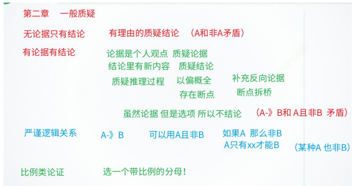
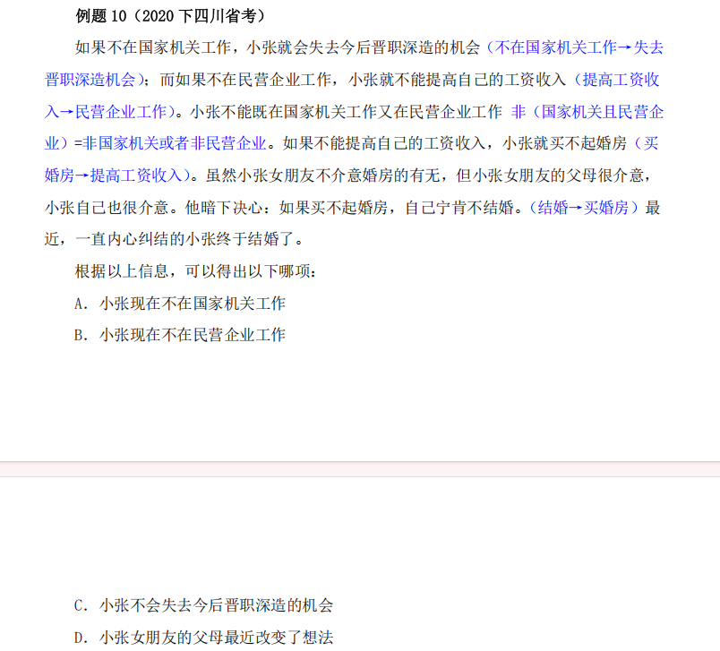
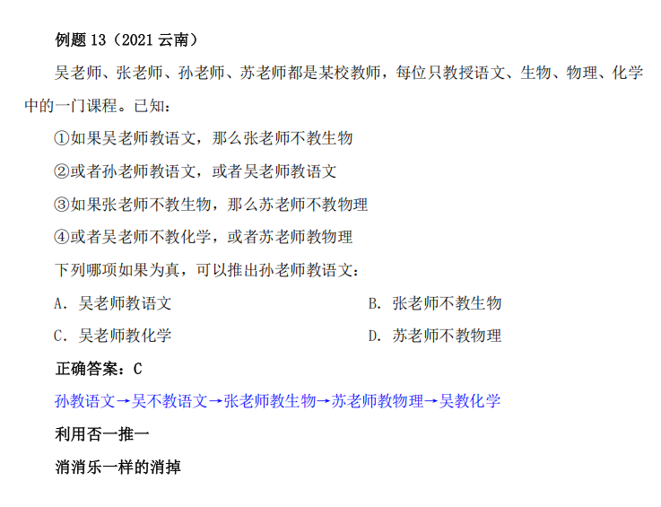
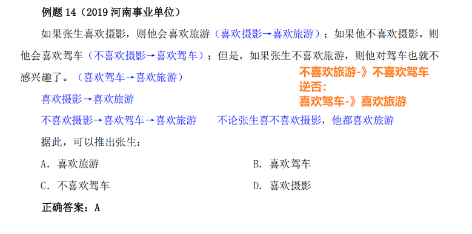
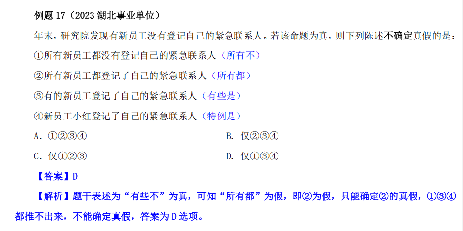

# 判断推理

## 1，一般归因

  

既成事实+原因分析 属于归因类题目

### 对比实验归因（横向）

### 时间对比归因（纵向）

### 一般归因

#### 质疑：

##### 另有他因（力度最小）

要回归实验！ 分组正确 

目的是把水搅浑 

警惕（伪他因）没回归实验

##### 因果倒置

把结果当成原因，把原因当成结果（果在前，因在后）

时间先后 继发关联

##### 否定此因

肯定不是当前这个原因，否定他

#### 支持：

##### 排除他因

##### 解释说明

### 直接根本原因

#### 质疑反对者

原观点 导致反对者观点 导致结果

#### 支持反对者

反对者观点 导致原观点 导致结果

### 补充或构成对比实验

#### 题干缺少对照组 或者 题干是纵向比较 补充横向比较

#### 三圈质疑

异因同果 同因异果

#### 四圈支持

异因异果

## 2，一般质疑

### 无论据只有结论

有理由的质疑结论（A和非A矛盾）

### 有论据有结论

####  质疑论据

论据是个人观点

#### 质疑结论

结论里有新内容 

虽然 论据 但是选项 所以不结论

虽然 xx 成立 但是因为某种原因，所以结论 不成立

#### 质疑推理过程

肯定论据作为前提

以偏概全

补充反向论据

存在断点 （论据和结论 的关系有点突兀，牵强）

断点拆桥 

### 严谨逻辑关系

A -》B 

质疑：A且非B

支持：A且B、非A且B、非A且非B

必要条件 放到 后面：努力学习是成功的必要条件，成功一定努力学习，不努力学习一定不成功

充分条件放到前面：60分时及格的充分条件，60分一定及格  ，但及格不一定60分

如果，那么  、只要，就、凡是，都 ：

A-》B 

如果平时分不及格，那么期末总分 就不及格 

非B -》非A   期末总分及格，则 平时分一定及格

逆否命题 逻辑相同

A是B的前提、必要条件 谁必要谁放到后面

只有，才  ：

非A -》非B (常考) 或者 B -》A 

### 比例类论证

题干中出现百分比 ，需要在选项中再选一个带百分比的

题干出现的百分比 是分子，选项是分母（要总人数 、教师总数、全市总人口 ）

## 3，**逻辑论证之支持、前提、解释**

### **五种常见支持方式** 

**解释说明**

**断点搭桥：**

​	1，题干A和B 选项找A->B 进行搭桥

**增加正向论据**（补充漏洞，数据事实）

**必要条件：**

​		此类选项一般没有极大的力度让结论肯定正确，但却是结论成立的必要前提，属于“没

他不行”选项，缺了这类选项，整个推理过程必然失败。

​		可采用反向代入的办法验证选项，若实际情况与选项相反，则必然得不出题干的结论，

那么此选项就是结论成立的必要条件

**举例支持**

注：

用变化支持/解释变化

比较要说两边

类比支持一般不选

补充论据要强于重复论据

### 三种常见的前提假设

断点搭桥

补充漏洞

必要条件

## 4，推出推理

推出类的几种题型：等价推出、正推/逆推、两难推理、范畴类推出

### **等价推出**

**等价推出**指的是将题干逻辑关系和选项逻辑关系分别翻译后，二者完全一致。考察的是

对翻译规则的掌握，常用知识点有命题的传递和原命题与逆否命题（a→b 和非 b→非 a）等

价。

题干中无逻辑关联词的部分不需要关注，直接寻找带有逻辑关联词的语句即可。

PS：a→b，a 是充分条件，b 是必要条件（记忆：谁是必要条件谁在箭头后）。

a和b至少一个：a或b

a和b至多一个：非a或非b

非（a 且 b）=== 非 a 或非 b

非（a 或 b）=== 非 a 且非 b

#### **与题干等价**（可以推出）

**解题技巧**：

①若将题干翻译为 A→B，可以翻译为 A→B 或非 B→非 A 为正确选项。因此，以 B 或非

A（肯后或否前）开头的选项可先排除。（忠于箭头） **前建伪**（a为假，则命题一定为真） **后建真**（b为真，则命题一定为真）

②若题干有多个带有逻辑关联词的句子，先不需要联立，有时答案只和其中一句有关。

③“a、b”“a，b”,表示的是“a 且 b”，不能写成“a→b”或“b→a”

#### **与题干不等价**（**不能**推出）

**解题技巧**：

若题干只有一个逻辑关系，可直接翻译选项，选项三个相同一个不同，直接选不同的选项即可（剩下3个都相同）

### 正推/逆推

#### **根据已知事实正推**(由此可以推出)

**解题技巧**：无需将题干中的多个命题联立，根据已知事实，按照逻辑传递规则推出即可。

#### **根据所需结果逆推**(哪项可推出xxx)

**解题思路**：首先将要得出的结论翻译到箭头后。要想得到 C，根据 B→C，需要 B 成立，

要想得到 B，根据 A→B，需要 A 成立，一步一步逆推即可。此类题目最常考察考点是“a 或

b”的“否一推一”，即要想 a 成立，需要 b 不成立。

或者吃西瓜或者吃葡萄，怎么能保证一定吃到葡萄呢？否一推一，不吃西瓜

### **两难推理**

**解题方法**：

A→B、非 A→B，可推出 B 成立（可翻译成无论是否 A，都会 B）；

A→B、A→非 B，可推出非 A 成立。 (相互质疑，A一定不成立，则非A成立)

a->b 的逆否（等价） 非b-》非a

只有a才b：翻译为b-》a，逆否为：非a-》非b，一般都用不不

### **范畴推理** 

**范畴推理**指的是根据直言命题（所有、有些、特指）之间关系和性质进行推理的题目，

也包括判定各集合之间包含、交叉等关系的题目

#### **直言命题考察** 

①所有、有些的否定：两词互换，后面加不

②推出关系：所有能推出有些、特指，特指能推出有些，有些推不出所有、有些

③有些的特殊考点：有些是推不出有些不是，有些 a 是 b 可以推出有些 b 是 a

#### **集合关系考察** （**一分为二画图法**）

找**所有**对应的 作为画图分界线

**所有**的表述画**实线**，**有些**的表述画**虚线** 虚线代表不了大小，可以很大，可以很小

1，有些参加“一对一帮扶”活动的员工获得了市级优秀员工奖，**所有**事业单位的人事部员工都参加了“**一**

**对一帮扶**”活动。所有事业单位的策划部员工都没有参加**“一对一帮扶**”活动。

如果以上陈述为真，可以推出：

A．有些事业单位的人事部员工获得了市级优秀员工奖（**奖可能在人事部圈外也可能在圈内**，推不出）

B．有些事业单位的策划部员工获得了市级优秀员工奖（策划部与获奖的不在一边，推不出）

C．有些获得市级优秀员工奖的员工属于事业单位人事部（同 A 选项，获奖的在圈内外不确定）

**D**．有些获得市级优秀员工奖的不是事业单位策划部的员工（奖和策划部不在一边，一定能推出）

2，**所有**来自外省市的学生，都需要住校；所有住校的同学，都必须参加**晨练**；有些来自外省市的学生参

加了社团；有些计算机专业的学生也加入了社团；**所有**计算机专业的学生都没有参加**晨练**。

由此**不能**推出以下哪项结论：

A．有些社团成员没有参加晨练（左边绿圈的社团和右边不参加晨练不在一边，可以推出）

B．有些外省市的学生是计算机专业的（左边外省的圈和计算机的圈不在一边，推不出）

C．所有外省市的学生都参加了晨练（外省蓝圈在左边参加晨练范围内，可以推出）

**D**．计算机专业的学生都不住校（计算机和住校在两边，没有交集，可以推出）

## 5，**分析推理**

### **真假话分析推理** 

#### **矛盾法**(逻辑矛盾)

①A 和非 A、A 且 B 和非 A 或非 B、A 或 B 和非 A 且非 B；

②所有和有些不，有些和所有不、可能和必然不、必然和可能不；

③A→B 和 A 且非B

1，某高校关于选派张强和李健谁去德国访学有三种不同的意见：

①张强去，李健就不去；②张强和李健都去；③张强不去。

学校领导研究后，同意了一种意见，否定了两种意见，由此可以推出：

A．张强去 

B．李健去

C．张强和李健都不去 

D．张强和李健都去

**【答案】A** 

**【解析】①张强->非李健，②张强且李建，①②矛盾，必定一真一假，由题干可知三个条件只有一真，**

**为真的条件在①②当中，则③一定为假，则张强去，所以答案为 A 选项。**

#### **假设**（假设某个命题为真）

1，青少年高校科学营旨在充分利用重点大学的科技教育资源，激发青少年对科学的兴趣，培养青少年的

科学精神、创新意识和实践能力。班主任鼓励甲、乙、丙、丁四位同学报名参加暑假举行的科学营。几天

后班主任向这四位同学询问录取的情况，他们的回答如下：

甲：乙被科学营录取了。（假）

乙：丙被科学营录取了。（假）

丙：甲或者乙被科学营录取了。

丁：乙或丙被科学营录取了。（假）

经过班主任调查，发现只有一位同学的回答与事实相符。

根据以上陈述，下列哪项为假：

A．丙说的是真话 

B．乙没有被科学营录取

C．被科学营录取的不是甲 

D．丁说的是假话

**【答案】C** 

优先找关联最多的人，进行假设，乙出现的频率最高，先假设乙，

**【解析】只有一位同学的回答为真。假设甲为真，则丁为真，假设乙为真，则丁为真。所以甲乙一定**

**为假，乙丙未被录取，则丁也为假，但是题干中有一人为真，只剩丙，丙为真，A 或 B 否一推一乙未被录**

**取则甲被录取。正确答案为 C 选项**

#### **代入**（太复杂时使用，带入选项）

1，甲、乙、丙、丁 4 位同学参加学校运动会。已知他们 4 人每人都至少获得 1 个奖项，4 人获奖总数为

10。关于具体获奖情况，4 人还有如下说法：

甲：乙和丙的获奖总数为 5；

乙：丙和丁的获奖总数为 5；

丙：丁和甲的获奖总数为 5；

丁：甲和乙的获奖总数为 4。

后来得知，获得 2 个奖项的人说了假话，而其他人均说了真话。

根据以上信息，甲、乙、丙、丁 4 人具体的获奖数分别应是：

A．2、3、2、3 

B．2、4、1、3

C．2、2、2、4 

D．2、2、3、3

**【答案】C** 

**【解析】从选项入手，发现甲一定为 2，由题干获得 2 个奖项的人说了假话，则乙丙获奖总数不是 5，**

**A，B，D 选项乙丙都为 5，只有 C 选项乙丙加和不是 5，所以正确答案为 C 选项。**

2，学校要举行文艺汇演，某系准备在唱歌、跳舞、相声、小品中确定一个或几个节目去参加。系领导通

过筛选，最终形成以下三种意见。

（1）对于唱歌和跳舞，至多选择一个；

（2）对于唱歌和小品，至少选择一个；

（3）如果选择相声或者小品，就不能选择跳舞。

最终参加文艺汇演的节目只满足上述一种意见。

根据以上陈述，以下哪项是正确的：

A．选择跳舞、相声、小品 

B．选择跳舞，但不选择相声和小品

C．选择唱歌、跳舞、小品 

D．选择相声、但不选择跳舞和小品 

**【答案】C** 

**【解析】由题干，三个条件只有一真，代入 A 选项，发现（1）（2）正确，已经两真，不符合题干要**

**求；代入 B 选项，（1）正确，（2）错误，（3）正确，两真不符题意；代入 C 选项，（1）错误，（2）正**

**确，（3）错误，一真两假，当选；代入 D 选项，（1）正确，（2）错误，（3）正确，两真不符合题意。**

#### **命题的真假判断**

1，某机关年终考核时，群众对周、吴、郑、王四位处长的考核结果有多种说法，其中，只有一种说法是

准确的。

①如果周处长考核优秀，那么吴处长也考核优秀；

②考核优秀者是郑处长；

③考核优秀者是周处长，但吴处长考核不是优秀；

④考核优秀者是周处长或王处长。

以下判断为真的是：

A．① 

B．②

C．③ 

D．④

**【答案】A** 

**【解析】①周优秀->吴优秀③周优秀且吴不优秀，①③矛盾一真一假，则②④为假，推出郑不优秀，**

**周和王不优秀，周不优秀则①的前件为假，命题为真，①为真，答案为 A 选项。** 

#### **两真两假模型**

**常见解题方法**：**先找矛盾，再假设**（或者/至少一般为真）；

1，甲和乙今年都报考了研究生，关于他们的考试有如下四个断言：

①他们俩人至少有一个考上（甲或乙）

②甲并不必然考上（甲可能靠不上）

③乙确实考上了

④并非是甲可能没考上（甲考上了）

最后录取结果表明：这四个断言中有两个是真的，两个是假的。

则下面哪一个结果可以从上述条件推出：

A．甲考上了，乙没考上 

B．甲和乙都考上了

C．甲和乙都没考上 

D．乙考上了，甲没考上

**【参考答案】A** 

**【参考解析】** 

第一步：将题干翻译

①他们俩人至少有一个考上：**甲或乙** 

②甲并不必然考上：**甲可能没上** 

③乙确实考上了： **乙** 

④并非是甲可能没考上：**非（甲可能没上）** 

第二步找矛盾：

**批注** **[1]:** 甲 不必然考上 ＝甲可能不考上②④矛盾，根据题干两真两假得出①③有一真一假；假设③为

真，那么①也为真，与题干两真两假矛盾；所以③为假（说明乙没考

上），①为真（根据否一推一，甲考上）；答案定位 A 选项。

### **日常分析推理**（推理判断第8讲）

**日常分析：**给出日常生活中蕴含逻辑关系的若干条件，需要考生抽丝剥茧找到其内在联

系并适当推理，此类问题**没有固定**的解题方法，真正考察了考生的逻辑思维。

 

**常用方法：**代入法、画图法、赋值法等。

**解题入手点：**一般可以从**确定信息**、**最大信息**入手。 

#### **画表法** 

1，小孔、小吴、小邓、小丁、小洪 5 人是某街道志愿者，某日他们被安排到南山、东江和

北苑 3 个小区进行社区服务。每个小区安排 1 至 2 人，每人只在一个小区服务。已知：

①安排在南山小区的志愿者最少

②若小邓、小丁中至少有 1 人安排在南山小区，则小吴安排在北苑小区（邓或丁 南-》吴 北）

③若小孔、小邓、小丁中至少有 1 人安排在东江小区，则在北苑小区服务的**只有小洪**（邓或孔或丁 东-》洪 北）

由此可以推出：

A．小吴安排在南山小区 

B．小丁、小洪安排在东江小区

C．小吴、小邓安排在北苑小区 

D．小邓、小丁安排在北苑小区

**【参考答案】D** 

**【参考解析】**

根据题干（每个小区安排 1 至 2 人，每人只在一个小区服务）得

知，三个小区分配人数为 122；根据①条件得出：南山小区 1 人，东江小区和北苑小区两人；

看条件③，若小孔、小邓、小丁中至少有 1 人安排在东江小区，则在北苑小区服务的只有小洪，已知北苑小区两人，所以不可能只有小洪；看逆否：北苑不是小洪→东江非孔且非邓且非丁；所以东江是小洪和小吴。

看条件②，若小邓、小丁中至少有 1 人安排在南山小区，则小吴安排在北苑小区；小吴没有在北苑（已知在东江），看逆否：小吴非北苑→南山非邓且非丁；则小孔在南山，小邓小丁在北苑。

第一步：画表

| 南山 | 东江 | 北苑 |
| ---- | ---- | ---- |
| 孔   | 洪   | 邓   |
| 空   | 吴   | 丁   |

#### **赋值法**

1，在某公司中，李明帮助了王刚，而王刚帮助了赵贤。李明纳税比赵贤多。

由此可以推出：

A．王刚纳税比赵贤多 

B．李明纳税和王刚一样多

C．有人帮助了一个纳税比他多的人 

D．有人帮助了一个纳税比他少的人

**【参考答案】D** 

**【参考解析】**

整合题干信息：李明帮王刚 王刚帮赵贤

李明纳税比赵贤多（假设李明 10 赵贤 5）

分析选项：;

A．王刚纳税比赵贤多,王刚纳税多少不知，无法得出，排除；

B．李明纳税和王刚一样多，同样王刚纳税多少不知，无法得出，

排除；

王刚纳税赋值有 5 种，第一种比李明（10）大，第二种比赵贤（5）小，第三种在李明和赵贤之间（10—5 之间），第四种等于李明（10），第五种等于赵贤（5）；

假设①王刚纳税 12：C 成立，李明（10）帮了王刚（12）符合有人帮助了一个纳税比他多的人。D 也成立，王刚（12）帮了赵贤（5）

符合有人帮助了一个纳税比他少的人；

假设②王刚纳税 8：C 不成立，李明（10）帮了王刚（8），王刚（8）帮了赵贤（5），不符合有人帮助了一个纳税比他多的人，符合

D 选项有人帮助了一个纳税比他少的人；

无论王刚纳税多少，D 选项恒成立

#### **极限思维**

### **特殊模型** （推理判断第8讲）

#### **不同角度分类模型** 

#### **包含关系模型** 

#### **多重身份模型** 

#### **数独模型**

#### **冠军模型** 

## 6，**推理方式与论证结构**

### **推理方式判断**（与上述推理方式相同）

#### **演绎推理**

是指从一般性的前提得出了特殊性的结论的推理。演绎推理包括三段论、假言推理、选言推理等

##### 三段论

它包含：一个一般性的原则（大前提），一个附属于前面大前提的特殊化陈述（小前提），以及由此引申出的特殊化陈述符合一般性原则的结论。

如：清华学生都很努力，小明是清华的学生，小明很努力

**解题技巧：**①所有＋有些＝有些，②是＋是＝是、是＋否＝否，③三种概念各出现两次

1，某培训机构的一些舞蹈教师拥有舞蹈师资格证，所以，该机构有些女教师拥有舞蹈师资格证。

为使上述论证成立，需补充的前提是：

A．该机构有些舞蹈教师是女教师

B．该机构有些女教师是舞蹈老师

C．该机构所有舞蹈老师均为女教师

D．该机构有些女舞蹈教师没有舞蹈师资格证

**【参考答案】C** 

**【参考解析】** 

题干**一些**舞蹈教师拥有舞蹈师资格证，所以，该机构**有些**女教师拥有舞蹈师资格证。两个有些缺一个**所有**，定位 C 选项。所有舞蹈老师均为女教师，有些有舞蹈师资格证的老师是该机构的一些老师，所以得出结论：有些有资格证的是女老师。

2，有些糕点师制作蛋挞，因此，有些蛋挞是蛋糕店出售的。

要使上述论证成立，需要增加的前提是：

A．所有糕点师都在蛋糕店工作

B．有些糕点师在蛋糕店工作

C．所有蛋挞都在蛋糕店出售

D．有些蛋糕店的糕点师不制作蛋挞

**【参考答案】A** 

**【参考解析】** 

题干有些糕点师制作蛋挞，因此，有些蛋挞是蛋糕店出售的，两个有些缺一个所有，排除 B 和 D 选项；

若选 C 选项，糕点师出现一次、蛋挞出现三次、蛋糕店出现两次，排除；

A 选项，糕点师出现两次、蛋挞出现两次、蛋糕店出现两次，当选。

所有糕点师都在蛋糕店工作，有些糕点师制作蛋挞，推出有些蛋挞是蛋糕店制作售卖的。

#### **归纳推理**

即从个别到一般，从特殊性的前提推出普遍的一般结论。归纳推理可分为完全归纳推理、不完全（简单枚举）归纳推理

##### 不完全归纳

1，“泰山天下雄”，以下选项与上述推理方式最相近的是：

A．我见青山多妩媚，料青山见我应如是

B．笑别庐山远，何烦过虎溪C．上有天堂，下有苏杭

D．自古华山一条路 

**【参考答案】D** 

**【参考解析】** 

“泰山天下雄”属于不完全归纳，C 选项更像一个类比，苏杭像

天堂一样；D 项也属于不完全归纳，定位 D 选项。

2，某刑事人类学家在对 260 名杀人犯的外貌进行了考察后，发现他们具有一些共同的生理

特征，于是得出“杀人犯具有广颚、颧骨突出、头发黑而短的特征”的结论。

以下哪项与上述推理方式相同：

A．24～28 之间没有质数

B．八月十五云遮月，正月十五雪打灯**（谚语都是不完全归纳）**

C．植物种子经超声波处理后可增产，所以玉米种子经超声波处理后也可增产

D．某高校在对全校学生进行调查后，得出“我校同学学习态度普遍较好”的结论

**【参考答案】B** 

**【参考解析】** 

题干属于不完全归纳，自古杀人犯不可能只有 260 名；B 选项也

属于不完全归纳，不可能统计出所有的八月十五和正月十五的情况；

A、D 选项，属于完全归纳，排除；

C 选项属于演绎推理，选项省略了一句话：所有种子经超声波处理后可增产，玉米种子是一种植物种子，所以玉米种子能增产，排除；

答案定位 B 选项

#### **类比推理**

是指从特殊性的前提得出特殊性的结论。一般情况下，这种推理基于两个或两类对象在某些属性上的相同或相似性，推断它们在其他属性上也可能相同或相似。

### **论证结构或错误相似**（与题干所犯逻辑错误相同）

1，有的金属是固体；铁是金属；所以，铁是固体。

下列选项与题干所犯逻辑错误相同的是：

A．有的犯罪行为严重地扰乱了社会秩序；李四的行为严重地扰乱了社会秩序；所以，

李四的行为是犯罪

B．有的科学家没有受过正规高等教育；张三没有受过高等教育；所以，张三是科学家

C．有的没有辨别能力的人是精神病人；精神病人没有民事行为能力；所以，没有民事

行为能力的人没有辨别能力

D．有的带刺的花是玫瑰；花园里的花带刺；所以，花园里的花是玫瑰

**【参考答案】 D** 

**【参考解析】** 

题干逻辑关系：有的金属（A）是固体（B）；铁（C）是金属（A）；

所以，铁（C）是固体（B）。

分析选项：

A 项：推理形式为“有的犯罪行为（A）是严重地扰乱了社会秩序（B）；李四的行为（C）是严重地扰乱了社会秩序(B)；所以，李

四的行为(C)是犯罪(A)”，与题干所犯逻辑错误不同，排除；B 项：推理形式为“有的科学家（A）不是受过正规高等教育(B)；张三(C)不是受过高等教育(B)；所以，张三(C)是科学家(A)”，与题干所犯逻辑错误不同，排除；

C 项：推理形式为“有的没有辨别能力的人(A)是精神病人(B)；精神病人(B)是没有民事行为能力(C)；所以，没有民事行为能力的人(C)是没有辨别能力(A)”，与题干所犯逻辑错误不同，排除；

D 项：推理形式为“有的带刺的花(A)是玫瑰(B)；花园里的花(C)是带刺(A)；所以，花园里的花(C)是玫瑰(B),与题干所犯逻辑错误相同，当选

## 1，2,3,4,5（和逻辑判断相关）

### 一个符号两种条件

充分条件-》必要条件 ：充分在前，必要在后

b是a的  基础、关键、前提、a必须b，a需要b，a离不开b，b必不可少、不可或缺  ：a->b

xx是充分条件，如果a那么b，只要a就b， a->b

当且仅当 a->b且b->a  互推

### 命题的形式与真假

原命题===逆否命题：a->b === 非b-》非a

### 三种推理方式

### 四种相对关系

### 五种逻辑关联词

要么要么 相同为假，不同为真

# 定义判断

切记定义判断不是“连连看”，找出一堆关键要素一一对应，这样做的结果就是“只见树木不见森林”。

**那到底什么是关键信息？** 

好多同学容易忽略的**“被定义词”，才是最关键信息**，试想，此定义有好多特征和要素，为什么选取其中一或两词作为其“名”，无其他原因，只因“名”里有最重要特征。

后续解释，是为了让我们更好理解被定义词，读题的过程，可看作是寻找被定义词中特征对应的过程，需特别关注的有主体、对象、特殊要求、中心语（此类信息在被定义词中往往无法包含）

## **单定义**

### **偏正短语式** 

1，**体验式采访**是指直接投入到所要报道的新闻事件中去体验生活，以获得新闻报道所需要

的素材，以及对新闻事件的认识。

根据上述定义，下列**不属于**体验式采访的是：

A．某报社要求年轻记者沉入生活，了解基层，以改变写官话、说套话的文风（没有采访，改变说话方式）

B．某作家为了解包身工的悲惨遭遇，深入到工厂中，写出报告文学《包身工》（体验+采访，采访好写书）

C．某记者为了解传销组织的真面目，打入到传销组织内部，揭示传销组织的骗局（体验+采访，了解骗局）

D．某电视台推出专栏《体验三百六十行》，派记者体验各职业一周并进行系列报道（体验+采访，推出报道）

**A 选项，类似体验性培训、学习，有体验但是无采访，不符合定义，当选。**

2，体育赛事赞助是指企业以现金、实物、服务、技术、人力资源等方式支持体育赛事，并,由此获得商业回报的行为，体现的是体育赛事组委会和体育赛事赞助商之间对等互换以谋求各自利益的关系。

根据上述定义，以下属于体育赛事赞助的是：

A．腾讯与 CBA 合作推出带有企鹅标志的篮球比赛装备

B．长城无偿提供给广州亚运会用于接送运动员的哈佛越野车

C．北京冬奥村为各国运动员提供免费理发与中医理疗服务

D．双星给中国乒乓球队免费提供运动员个人专属球拍定制服务

【参考答案】B

【实战解析】

A 选项，属于体育赛事但不是赞助，只是合作，不符合定义，排除；

C 选项，主体北京冬奥村不是企业，不符合定义，排除；

D 选项，球队不是体育赛事，不符合定义，排除。

### **主体、对象、特殊要求、中心语**

1，代际责任：指在不超出自身能力的前提下，**相邻两代人**的一方向另一方主动提供经济帮扶、生活照顾、健康保障、精神抚慰等各种支持的行为。

下列**不属于**代际责任的是：

A．苏女士把父母接到身边后，忙乎了一个多月，带着父母熟悉小区健身器材，到社区老年活动中心打牌下棋，在公园找人聊天，终于帮他们重新找到了“组织”

B．邵先生和妻子一直在城里忙于打拼，女儿正在读小学。每到寒暑假，邵先生的父母都会专程赶到城里，把孙女接回农村老家痛痛快快地玩上整个假期**（邵先生父母和邵先生，父母照顾孙女，其实是帮助了邵先生）**

C．罗奶奶像无数为孩子婚事发愁的长辈一样，每到周末就去附近公园的相亲角浏览展板上的照片、简历，觉得合适的就记下基本情况、电话号码。虽然快三十岁的孙女根本不着急，她却一直乐此不疲

D．毛先生喜欢第一时间把遇到的趣事分享到家族微信群，却很少得到期待的回应，一怒之下退了群。后来，儿子又把他请回，还邀约了几位有同样爱好的长辈，群里逐

【参考答案】C

【实战解析】

C 选项，罗奶奶帮助孙女，属于隔代人，不符合定义，当选。

2，**回应性监管**是指政府通过制度设计，采用多样化的监管手段和策略对市场主体和社会组,织进行动态化、智能化、差别化的监管。回应性监管强调监管**主体的多元化**，除政府以外，企业、社会组织，乃至被监管对象都是监管主体；在监管策略上，采取差异化、阶梯化的监

管方式，即政府首先鼓励自我监管，难以奏效时才采取更为严厉的强化型自我监管直至命令控制型监管。

根据上述定义，下列选项**没有**体现回应性监管的是：

A．某地主管部门因食品安全问题突击整顿涉事企业

B．瑞典立法要求工作场所必须建立安全环保的内控体系

C．英国成立企业、工会代表组成的大健康监管委员会

D．聘请专业的第三方机构对企业安全生产状况进行评估

【参考答案】A

【实战解析】

A 选项，老方法，不涉及“政府首先鼓励自我监管，

3，**认知计算**是指**机器**通过与人的自然语言交流及不断学习从而帮助人们做到更多的系统。认知计算试图解决生物系统中的不精确、不确定和部分真实的问题，以实现不同程度的感知、记忆、学习、语言、思维和问题解决等过程。

根据上述定义，下列**不符合**认知计算的是：

A．甲公司通过开发一套认知系统来提高销售产量，这套系统使用了机器学习来对顾客进行分类并且指导销售员工对不同顾客销售哪种产品

B．乙平台是一套基于云的解决方案，它能够辨识网络外部防御的异常行为，之后识别出恶意软件的侵害或数据损失，协助行为分析和异常探测工作

C．丙公司推出的智能机器人，可以与人类正常沟通，可以在银行、餐饮、零售、酒店、医疗等领域为人类提供智能的信息化服务

D．丁国“脑科学时代计划”把建立认知、运动、行为和思想的计算原理列为重点研究

【参考答案】D

【实战解析】

D 选项，是一种计划，并不是一个系统，不符合定义，当选

## **多定义**

1，互补品是指两种商品之间存在某种消费依存关系，即一种商品的消费必须与另一种商品的消费相配套。互补品一般可以分为两类：**普通互补品**，指两种商品之间没有固定的同时使用的比例；**完全互补品**，指两种商品之间必须按照固定不变的比例同时被使用。

根据上述定义，下列选项正确的是：

A．数码相机和胶卷属于完全互补品 （数码相机 不用胶卷）

B．薯条和汉堡属于普通互补品（可以单独购买）

C．毛笔和墨汁属于普通互补品 

D．眼镜框和眼镜属于普通互补品（1副眼镜框、2个镜片）

【参考答案】C

【实战解析】

C 选项，毛笔和墨汁需要相互搭配使用，且没有固定比例，符合定义，当选。

2，**单播**是单点对单点数据传输；**组播**是单点对特定多点数据传输，发出一份数据包，**特定的多点同时**接收；**广播**是单点对**非特定**多点传输，发出一份数据包，非特定多点同时接收。

根据以上定义，下列选项中利用了组播技术的是：

A．观看付费电视频道节目 （付费的人 才能同时看到）

B．双人视频通话（单播）

C．收听电台节目 （广播）

D．通过视频 APP 点播电视剧（广播）

【参考答案】A

【实战解析】

A 选项，电视频道节目是同时接收，付费的人属于特定多点，符合定义，当选。

## **专业性定义题** 

### **法律相关**

忠于罪名定义，多做罪名就会变；专业人士会有其他专门的罪名

1，包庇罪是指明知是犯罪的人而为其提供隐藏处所、财物，或者帮助其逃匿，或者作假证,明包庇的行为。但事前通谋的，以共同犯罪论处。

根据上述定义，下列可能构成包庇罪的是：

A．李某与黄某等人商定，由黄某等人抢劫金店，由李某负责藏匿抢劫所得赃物，黄某等人抢劫得手后，李某将赃物藏于自家的仓库内

B．张某盗窃了博物馆的一幅名画，将其藏于床下，被母亲发现，母亲询问张某，得知为盗窃所得，遂将该幅名画烧毁**（多了烧毁）**

C．赵某被王某绑架，公安机关迅速侦破此案并成功解救赵某。后赵某收受王某亲属 20万元，推翻了之前对王某不利的陈述，谎称是自愿和王某走的

D．侯某是涉嫌杀人罪的犯罪嫌疑人于某的辩护律师，为获得高额的代理费用，侯某伪造大量证据，成功帮助于某脱罪（**律师罪名不一样）**

【参考答案】C

【实战解析】

C 选项，“谎称是自愿”符合作假证明包庇的行为，当选。

### **医学相关**

联系实际，把自己当做医生

1，焦虑性神经官能症是以广泛性焦虑症（慢性焦虑症）和发作性惊恐状态（急性焦虑症）为主要临床表现，是一种无根据的惊慌和紧张或其紧张惊恐程度与现实情况很不相称，心理上体验为泛化的、无固定目标的担心惊恐，生理上伴有警觉增高的躯体症状。

根据上述定义，下列属于焦虑性神经官能症的是：

A．上高三的小李平时上课表现得非常正常，但是遇到老师提问他时就紧张的说不出话来，即使自己会的问题也回答不出来

B．老李被查出来患有肿瘤，一想到自己可能不久于人世，老李就非常的惊恐（这是害怕）

C．最近某市发生了几起入室盗窃杀人案，一天晚上小丽老公加班没有回来，小丽整晚都非常担心，几乎没睡觉（一晚上不可能直接得焦虑证）

D．小孙最近刚失恋，她每天把自己关在家里，伤心欲绝，痛苦不已（正常）

【参考答案】A

【实战解析】

A 选项，小李被提问时自己会的问题也回答不出来，符合“无根据的惊慌和紧张或其紧张惊恐程度与现实情况很不相称”，符合定义，当选。

### **经济、科学等** 

1，科学预测：指基于已掌握的规律，通过科学分析和预测，对未来可能发生的现象，作出,允许质疑及检测的推测。

下列属于科学预测的是：

A．旅行团导游提醒大巴司机：明天是周末，出城的车子太多，路上很可能出现严重的拥堵现象，要想按时到达目的地，至少得提前半小时出发（经验之谈，不是科学预测）

B．某地发生了一起刑事案件，警察迅速对犯罪现场进行仔细勘查，根据收集到的信息材料，很快确定并抓获了犯罪嫌疑人，仅用了 3 小时就破了案 （没有预测，直接抓获）

C．电视台的天气预报节目中，播报员都会例行性地对未来十天的天气变化情况进行简要预报，有时还会请气象专家对天气变化原因作出分析

D．老胡刚拿到体检报告，发现有几个指标不正常，极为紧张，忙去找医生，医生看过体检报告后告诉他：“超标情况不严重，注意休息，很快就会恢复正常” （没有预测，这是对报告进行了 解释）

【参考答案】C

【实战解析】

C 选项，天气预报是经过科学分析得出的预测，符合定义，当选。

2，定律假说是对一类事物或现象的性质或发生原因作出推测性解释,得出一个可能具有普,遍性意义的规律性命题,从而试图建立、发展或补充科学理论。

根据上述定义,下列属于定律假说的是：

A．老师向学生们解释潮汐现象产生的原因是海水在引力作用下出现的周期性运动（对已知知识的讲解）

B．某单位仓库被盗,由于未发现破坏性进入的痕迹,侦查人员认为内部人员作案的可能性极大（不是为了建立理论，只是预测）

C．牛顿根据苹果掉落现象发现了万有引力定律

D．有研究人员提出,由基因导致的疾病可能都是由于基因突变引起的 （提出，更像是一种猜想，不是为了建立理论）

【参考答案】C

【实战解析】

C 选项,“万有引力定律”，属于定律，符合定义，当选。

## **常用技巧**

### **造句法**

1，R 关系的非对称性指的是存在论域中的元素（或对象）x、y，xRy 并且 yRx 都成立；也,存在论域中的元素（或对象）m、n，mRn 成立但是 nRm 不成立。

根据上述定义，以下哪项中的关系具有非对称性：

A．以所有人作为论域的亲戚关系 （双方一定都是亲戚）

B．以所有人作为论域的抚养关系 （双方一定是抚养关系）

C．以所有人作为论域的祖孙关系  （x是y的祖母，但y不是x的祖母）

D．以所有人作为论域的尊重关系（x尊重y，y尊重x，m尊重n,n可以不尊重m）

【参考答案】D

【实战解析】根据选项代入语句，判断是否成立，如图所示，只有 D 选项满足，当选。

### 根据“与众不同”确定答案

1，商业效用原则是商事实践中发展出来的一项交易惯例，市场主体提供的商品、服务以及,其他标的物应当能够发挥基本的功能作用，如果欠缺必要的使用条件或者辅助设施导致其交易目的落空的，应当予以补足。最佳效用原则是指通过配置组合，使得资源能够最大程度地发挥效能，提高利用效率。

根据上述定义，下列选项最能体现商业效用原则的是：

A．开发商销售商品房赠送车位 

B．商家促销“买桌子送椅子”

C．出售的地下酒窖附带出入通道 

D．购买家电享受“三包服务”

【参考答案】C 

【实战解析】A 选项：卖房子赠车位；

B 选项：卖桌子赠椅子；

D 选项：卖家电赠三包服务；

C 选项：卖地下室赠送通道，其中：车位、椅子和三包服务都是可有可无的，只有通道是必须要有的，C 选项特殊，当选。且题干中“能够发挥基本的功能作用”表意为：必须的东西，只有 C 选项符合。

2，美国著名心理学家麦克利兰于 1973 年提出著名的素质冰山模型，将个体素质划分为表,面的“冰山以上部分”和深藏的“冰山以下部分”，其中，“冰山以上部分”是人的外在表现，是容易了解与测量的部分，可以通过培训来改变和发展。而“冰山以下部分”是人内在的、难以测量的部分。它们不大容易通过外界的影响而得到改变，但却对人的行为与表现起着关键性作用。

根据上述定义，下列对某人的描述属于“冰山以上部分”的是：

A．小张在车祸中失去双臂，但是他没有就此消沉，而是积极乐观的面对困境

B．小费作为公司新开发项目的团队成员，他非常注重与其他团队成员的合作

C．小李追求卓越、挑战自己的品质，使他取得了一个又一个丰硕的成果

D．中文系毕业生小王，拥有丰富的文学知识

【参考答案】D 

【实战解析】A 、B、C 选项都是用品德、品行方面的。D 是知识，知识是可以通过培养提升的，可以改变。故选答案 D。

### 根据“新旧”确定答案

1，按运营主体分类，电子商务模式可分为传统电商模式和内容电商模式。传统电商模式是,指消费者在全品类电商平台上通过搜索、浏览、比价等操作来购买所需的商品。内容电商模式是指平台通过传播优质内容吸引对内容感兴趣的人群，进而引导其购买内容相关的商品。

根据上述定义，下列不涉及**内容电商模式**的是：

A．甲平台邀请多位明星为其代言，并投放了线上广告，吸引了大批粉丝购买该平台的商品

B．主打体育新闻的乙平台是体育爱好者们的聚集地，平台售卖的球鞋、球衣等商品销量不俗

C．丙平台是专为职场女性打造的社交平台，该平台自营的化妆品深受各年龄层女性用户喜爱

D．某主播在丁平台为扶贫食品直播带货，质朴不失幽默的风格大受好评，商品很快便销售一空

【参考答案】A 

【实战解析】A 选项只是投广告，名人效应而已，且九十年代就是这种推销方式，没涉及内容电商。

B、C、D 选项都是用内容吸引人，在过程中卖东西。A 就是传统模式。故选答案 A。

# 类比推理

总体做题思想：类比题目相对比较简单，**难题多为掺杂常识**，做类比题一定注意“大众思维”和“简单思维”，多想内在联系，即**词与词**本身有没有联系，例如“猎豹-速度快”、“蜜蜂-采蜜”等等。

做类比题目要“**以我为主**”，主动去找到题干与选项的内在联系；切忌被出题人“牵着鼻子走”，因为类比推理是假设性推理，如果逼着自己去给选项找理由，总能找到千奇百怪的理由。

## 语义关系

### 反义和近义（同义）

近义（同义）、反义关系：词语含义相近（相同）或相反。

补充知识点：**成语**的常见考法为语义、褒贬和结构分析。

**反义**

1，先礼：后兵

A．居安：思危 

B．头重：脚轻

C．鞍前：马后 

D．生离：死别

【参考答案】B 

【实战解析】先和后是反义词 ，排除 A,C.礼和兵是反义词，排除 D.头和脚反义词，重和轻反义词，B 当选。

**近义词**

2，骈偶：颠倒

A．语言：科技 

B．贡献：共享 （享：吃的意思）

C．开关：旋转 

D．把握：给予

【参考答案】D 

【实战解析】骈和偶是近义词，颠和倒是近义词，D 把和握是近义词，给和予是近义词，当选。

**褒贬义**

志同道合：沆瀣一气

A．居安思危：杞人忧天 

B．鼠目寸光：高瞻远瞩

C．举棋不定：优柔寡断 

D．口若悬河：信口开河

【参考答案】A 

【实战解析】志同道合是志向相同道路相同，沆瀣一气是臭味相投，两词意思相近，一个褒义一个贬义。B 项的鼠目寸光和高瞻远瞩是反义词，排除；C 项的举棋不定和优柔寡断是近义词，但都不是褒义词，排除；D 项口若悬河是说个没完，是中性词，没有褒贬色彩，

排除； A 项居安思危是要有危患意识，是褒义，杞人忧天是不必要的担心，是贬义，二者意思相近，一个褒义一个贬义，当选。对应选项 A。

### 引申、象征、一语双关

**引申义**：指一个词的本身引申出来的意义。

**象征义**：通过某些具体事物象征某些抽象含义。

**一语双关**：一个词或一句话关涉到两个意思

**象征义**

1，白鸽 对于 （ ） 相当于 （ ） 对于 权力

A．杜鹃；帝王 

B．橄榄枝；政治

C．好运；宪法 

D．和平；权杖

【参考答案】D 

【实战解析】白鸽象征和平，权杖象征权利

**引申义**

2，胃口：兴趣

A．心腹：器官 

B．黑马：比赛

C．桃李：学生 

D．亲人：骨肉

【参考答案】C 

【实战解析】兴趣是胃口的引申义。

A 项器官是心腹的本义，排除；B 项比赛不是黑马的引申义，黑马的引申义是开始不被看好后来逆袭的选手，排除；D 项骨肉引申义一般是自己的孩子，不是指亲人，排除；C 项学生是桃李的引申义，当选，对应选项 C。

### 意思解释

意思解释：一个词语是对另一词语的意思解释。

1，转念：主意

A．转述：说话 

B．转交：物品

C．转向：方向 

D．转录：翻译

【参考答案】C 

【实战解析】 转念是改变主意，转向是改变方向，要考虑转是改变的意思，C 当选

2，顿悟 对于 （ ） 相当于 研究 对于 （ ）

A．灵感；探索 

B．观察；实验

C．思维；实践 

D．真理；信仰

【参考答案】A 

【实战解析】顿悟是灵感来了，研究是进行探索，近义词，A 当选。

顿悟和观察未必有关，顿悟和思维未必有关，顿悟和真理未必有关，B,C,D 排除。

### 同字不同义

同字不同义：指相同的字在不同的词语中表达的意思不同。

1，峰：山峰：碳达峰

A．界：世界：思想界 

B．潮：海潮：移民潮

C．子：儿子：菜篮子 

D．羊：山羊：领头羊

【参考答案】B 

【实战解析】山峰的峰是峰的本义，山的顶端，碳达峰是说峰值的意思，像山峰一样的顶端，一个本义一个象征义。

 A 项的界都是范围，没有象征义，排除；

C 项的菜篮子的子没有含义，排除；

D 项的领头羊的羊指的也是本义，不是引申义，排除；

B 项海潮是本义，移民潮像海潮一样的趋势， 是象征义，当选，对应选项 B

2，火：火急：火警

A．虎：虎将：虎劲 

B．蛇：蛇行：蛇胆

C．牛：牛毛：牛饮 

D．鹊：鹊桥：鹊起

【参考答案】B 

【实战解析】火急是像着火一样着急，是火的比喻义，火警是火的本义。（不是消防员的意思，是着火的警报，火 是真火，火的本意）

A 项虎将和虎,劲都是比喻义，排除；

C 项牛毛是本义，牛饮是比喻义，与题干顺序相反， 排除；

D 项鹊桥是本义，鹊起是比喻义，与题干顺序相反，排除；

B 项蛇行是比喻义，蛇胆是本义，当选，对应选项 B

## 语法关系

### 词性考察

**词性考察**：多考察名词、动词、形容词

**名词**

1，手足：手：足

A．江湖：江：湖 

B．巨大：巨：大

C．拉扯：拉：扯 

D．给予：给：予

【参考答案】A 

【实战解析】手、足都是名词，有本义还有引申义：兄弟如手足。

A 选项，江、湖都是名词，江湖的引申义是指社会。

B 选项，巨、大是形容词；

C 选项，拉、扯是动词；

D 选项，给、予是动词

**名词，动词**

2，教案 对于 （ ） 相当于 （ ） 对于 分类

A．课件；信息 

B．教学；归类

C．提纲；商品 

D．授课；标准

【参考答案】D 

【实战解析】题干中，教案是名词，第二个空也应该是名词，分类是动词，因此，选项,最好 是一个动词，一个名词，D 选项符合，A、B、C 不符合。再代入题干，按照教案授课，按照标准分类，可以类比

**形容词**

3，畅通：拥堵

A．结实：松散 

B．详尽：简略

C．踏实：忧虑 

D．男性：女性

【参考答案】B 

【实战解析】题干是反义词，且形容词。B 选项是反义词，而且是形容词，当选。A 选,项，松散的反义词更偏向紧凑，结实没有凑在一起的意思；C 和 D 均不符合

### 结构考察

**结构考察**：多考察动宾、主谓、偏正、主宾、并列等。

偏正：形容词 在前 

主宾/主谓宾 ： 动词连接

**偏正**

1，劲敌：严冬

A．良师：暴雪 

B．朋友：海洋

C．阿爸：老虎 

D．知音：飞鸟

【参考答案】A 

【实战解析】劲敌和严冬都是偏正，良师和暴雪都是偏正，A 当选。阿爸、老虎、朋友、知音都是名词。

**并列，近义词**

2，政通人和：国泰民安

A．深思熟虑：不假思索 

B．星罗棋布：漫山遍野

C．心领神会：心照不宣 

D．奋起直追：迎头赶上

【参考答案】B 

【实战解析】

首先从词义来看，政通人和和国泰民安是近义词，都是形容国家态势好,排除 A 选项。

然后题干中的成语：政通和人和是并列结构，国泰和民安是并列结构，本身结构特殊，考结构可能性更大，C 选项，心领和神会是并列，心照和不宣不是并列，排除；D 选项，奋起修饰直追，迎头修饰赶上，不是并列结构，排除。

B 选项符合上述两项的同时，政通人和和国泰民安都是形容国家态势好的状态，星罗棋布和漫山遍野都是形容分布比较广的状态，都是形容一种状态，但是 D 选项不是形容一种状态，而是一种动作，所以本题倾向于不选 D。 有些同学会认为这道题考的是因果关系，政通人和才能国泰民安，奋起直追才能迎头赶上，这也是一种思路，但是由于本题题干结构非常清晰，所以倾向于选 B。

**动宾 **要考虑在此处的词性

厚 薄 本是形容词，厚此薄彼，的意思是厚待某人，薄待某人，在这个成语里 是动词，所以 此处是动宾

3，厚此：薄彼

A．惩前：毖后 

B．口蜜：腹剑

C．舍本：逐末 

D．阳奉：阴违

【参考答案】C 

【实战解析】厚此与薄彼并列，反义，并且都是动宾结构。惩前和毖后不是反义，排除A 选项，口蜜和腹剑不是反义，排除 B 选项，阳奉和阴违不是动宾，是偏正，排除 D 选项。舍本和逐末并列，反义，动宾结构，选 C。

**主谓宾**

4，愚公移山：郑人买履

A．弄巧成拙：囫囵吞枣 

B．杞人忧天：庖丁解牛

C．邯郸学步：东施效颦 

D．凿壁偷光：田忌赛马

【参考答案】B 

【实战解析】愚公移山和郑人买履，都是主谓宾结构。弄巧成拙不是主谓宾，排除 A 选,项；邯郸学步是去邯郸学步，不是主谓宾排除 C 选项；凿壁偷光不是主谓宾结构，排除 D 选项；杞人忧天和庖丁解牛都是主谓宾结构，B 当选。

**名词**

5，春山暖日和风：阑干楼阁帘栊

A．绿蚁新醅酒：红泥小火炉 

B．鸡声茅店月：人迹板桥霜

C．江碧鸟逾白：山青花欲燃 

D．柴门闻犬吠：风雪夜归人

【参考答案】B 

【实战解析】列锦：表景色的名词依次排列，且没有别的形容。例子：枯藤老树昏鸦，小桥流水人家。题干左右都是 3 个名词并列。B 选项符合。

### 句子成分考察

**句子成分考察**：将所给词语构造成短句，每个词语在句子中的位置、成分一致

1，风险：社会：预防

A．食品：安全：维护 

B．腐败：官员：惩治

C．超车：弯道：严禁 

D．命运：改变：读书

【参考答案】B 

【实战解析】预防社会风险，预防是动词，社会风险是偏正短语，社会的风险。维护安全食品，不一致，排除 A 选项；严禁弯道超车，弯道超车不是偏正短语，排除 C 选项；读书改变命运是主谓宾，排除 D 选项；惩治 官员腐败，惩治是动词，官员腐败是偏正短语，B

2,奋进：新征程

A．冲锋：新一线 

B．抢占：制高点

C．应对：新挑战 

D．守好：主战场

【参考答案】A 

【实战解析】向新征程奋进/在新征程上奋进，A 选项，冲锋后不接宾语，向新一线冲锋。而 B\C\D 都是动宾，A 当选。

3,局域网：计算机：文件共享

A．空间站：航天员：科学实验 

B．图书馆：阅览室：文献检索

C．纺织厂：纺织设备：原料加工 

D．电视台：网络媒体：节目制作

【参考答案】C 

【实战解析】在局域网中（地点） 用计算机（工具）进行文件共享（内容）

A 选项：在空间站（地点）航天员（人物） 不符合上述逻辑排除

B 选项：图书馆阅览室都是地点 不符合

C 选项：在纺织厂用纺织设备进行原料加工，符合

D 选项：在电视台，网络媒体进行节目制作（不合现实逻辑）

## **范畴关系**

### **全同关系**

**全同关系**指的是两个词或概念表示的是同一个意思，即两个概念的外延完全重合。常见的全同关系包括古今、中外、自他、雅俗、同义词等。例如：父亲与爸爸、蹴鞠与足球。

1,分母：除数

A．内角：外角 

B．加减法：乘除法

C．横坐标：纵坐标 

D．百分比：百分率

【答案】D 

【解析】分母和除数起到的作用是一样的，但是形式不一样。D 选项符合。

2,伊妹儿：电子邮件

A．算账：结账 

B．引擎：发动机

C．炒鱿鱼：解雇 

D．可可：巧克力

【答案】B 【解析】左边是英文音译，右边是中文名，全同关系。B 选项符合。

### **并列关系**

**并列关系**指的是两个事物是完全不同的，但属于同一类事物或具有相同的属性或功能。即两者属于同一层级的不同概念。并列关系可细分为**矛盾关系**和**反对关系**。

矛盾关系:不是a就是b，只有两种情况

反对关系：多种情况

**大并列**  四字并列：笔墨纸砚、琴棋书画、梅兰竹菊、酸甜苦辣

1，春夏：秋冬

A．生老：病死 

B．昨天：今天

C．日出：日落 

D．雷鸣：暴雨

【答案】A 

【解析】春夏秋冬为并列的四个字。A 选项为生老病死四种状态的并列，当选；B 选项非四个并列的单字，排除；C 选项日出日落是主谓，非四个并列单字，排除；D 选项，雷鸣是主谓，暴雨是偏正，排除。

2，毛笔 对于 （ ） 相当于 （ ） 对于 菊花

A．颜料；丁香 

B．狼毫；花蕊 

C．国画；园丁 

D．砚台；花坛

【答案】A 

【解析】A 选项，毛笔、颜料都是作画工具，丁香和菊花也是并列的两种不同的花，都,是并列关系，当选。

**并列，时间顺序**  汉字顺序：甲骨文、金文、篆书、隶书、楷书、草书、行书

3，诗：赋：词

A．纸：丝绸：竹简 

B．昆曲：戏剧：京剧

C．油画：水墨画：工笔画 

D．甲骨文：隶书：楷书

【答案】D 

【解析】诗、赋、词是文学体裁，同时有出现的时间顺序，为并列关系。A 项纸、丝绸、竹简是都能写字的并列关系，时间顺序与题干不符，排除；B 项昆曲、京剧都属于戏剧，排除；C 项工笔画是绘画的一种技艺，与油画和水墨画无法构成并列关系，排除；D 项甲骨文、

隶书、楷书是汉字的种类，并列关系，且出现时间顺序与题干一致，当选。

#### **并列之矛盾反对**

**反对关系**表示除了这两个选项之外还有其他选项，即除了 A、B 之外，还有 C 或其他。例如：苹果和梨、红色与黑色。 

**矛盾关系**表示非此即彼的关系，即除了 A 就是 B。例如：生与死、合法与非法； 

**反对，反义**

1，乾：坤

A．秦：汉 

B．中：外

C．纵：横 

D．宇：宙【答案】C 

【解析】乾、坤都是八卦之一，两者并列－反对，并且乾坤分别有天、地的意思，二者

属于反义。A 选项秦、汉是并列－反对，不是反义，排除。B 选项中、外属于并列－矛盾，

排除。C 选项纵、横属于并列－反对，且属于反义，当选。D 选项二者属于并列－矛盾，但

不是反义，排除。

**矛盾**

1，线性振动：非线性振动：振动

A．花瓣：花蕊：牵牛花 

B．食肉动物：食草动物：动物

C．投资者：经营者：市场主体 

D．主要矛盾：次要矛盾：矛盾

【答案】D 

【解析】线性振动、非线性振动两者矛盾，都和振动构成种属关系。A 选项花瓣、花蕊

属于反对，是牵牛花的一部分，排除。B 选项食肉动物、食草动物属于反对，排除。C 选项

投资者、经营者属于反对，排除。D 选项主要矛盾、次要矛盾是矛盾关系，且都和矛盾构成

种属关系，符合题意，当选。

### **包含关系**

**包含关系**指的是一个概念包含另一个概念的全部外延。包含关系可细分为**种属关系**和**组**成关系。有时也需要注意名词是特指还是泛指

涉及时间，地域，都是组成  如：西汉、东汉 都是汉朝的组成，东欧、西欧 都是欧洲的组成

#### **包含之种属关系**

**种属关系**表示一个概念的全部外延与另一个概念的部分外延重合的关系，即一个对象是另一个对象的一种。当两个词可以造句为“A 是 B（的一种、一类）”时，说明两者是种属关系

1，深空探测 对于 （ ） 相当于 （ ） 对于 公益组织

A．无人采样；慈善捐款 

B．遥感技术；红十字会

C．宇宙空间；公益事业 

D．火星探测；社会组织

【答案】D 

【解析】本题选择 D，考察种属关系。火星探测是一种深空探测，公益组织是一种社会组织，当选；A 选项，深空探测时可能有一项工作是无人采样，不能说慈善捐款可能有一项工作是公益组织，排除；B 选项遥感技术是深空探测可能会使用的技术，排除；C 选项深空探测在宇宙空间里，不能说公益事业在公益组织里，排除。

2，儿童读物：启蒙读物

A．连续变量：离散变量 

B．刑事诉讼：民事诉讼

C．生产资料：生活资料 

D．一类疫苗：麻疹疫苗

【答案】D 

【解析】启蒙读物是儿童读物，种属关系。A 选项连续变量与离散变量是并列关系，排,除；B 选项刑事诉讼与民事诉讼是并列关系，排除；C 选项生产资料与生活资料是并列关系，排除；D 选项麻疹疫苗是一类疫苗，种属关系，当选

**种属，且 特指**

3，苏格拉底：人类

A．松树：植物 

B．故宫：建筑

C．《唐诗三百首》：书籍 

D．太阳：恒星

【答案】D 

【解析】苏格拉底是人类，种属关系，且苏格拉底是特指。A 选项松树是植物，但松树是泛指，排除；B 选项故宫是建筑，但故宫不是特指，有北京、沈阳、台北故宫，排除；C选项《唐诗三百首》是书籍，但《唐诗三百首》有不同出版社出版的不同版本，排除；D 选项，太阳是恒星，种属关系且太阳为特指，当选。

#### **包含之组成关系** 

 

**组成关系**表示一个概念是另外一个概念的组成部分，即整体和部分之间的关系。当两个词语造句为“A 是 B 的一部分”，说明两者是组成关系

1，省份：河北：石家庄

A．水果：桃子：桃核 

B．亚洲：中国：北京

C．昆虫：蜜蜂：蜂蜜 

D．企业：民企：华为

【答案】A 

【解析】河北是省份，二者是种属关系，石家庄是河北的一部分，二者是组成关系。A,选项，桃子是水果，二者是种属关系，桃核是桃子的一部分，二者是组成关系，符合，当选。B 选项中国是亚洲的一部分，北京是中国的一部分，二者都是组成关系。C 选项蜜蜂是昆虫，二者是种属关系，但蜂蜜不是蜜蜂的一部分，排除。D 选项民企是一种企业，**华为是民企**，都属于种属关系，排除。

2，（ ） 对于 膝盖骨 相当于 地铁站 对于 （ ）

A．膝盖；地铁 

B．腿；站台

C．器官；列车 

D．肩胛骨；终点站

【答案】B

【解析】A 选项，膝盖骨是膝盖的一部分，但是**地铁不是地铁站的组成部分**，排除。B选项，膝盖骨是腿的一部分，站台是地铁站的一部分，逻辑一致，当选。C 选项膝盖骨是一个器官，但列车不是地铁站，不一致，排除。D 选项，肩胛骨和膝盖骨属于并列，地铁站和终点站属于交叉，不一致，排除。

#### **交叉关系**

**交叉关系**指的是两个不同概念的外延间有部分重合，即如果满足“有的 A 是 B，同时有的 A 不是 B，有的 B 不是 A”这个句式，那么 A 和 B 就满足交叉关系

**并列，交叉** 并列大部分不看二级辨析，即是否矛盾

1，匿名投票：实名投票：现场投票

A．早间会议：午间会议：工作会议 

B．战国文字：象形文字：古代汉字

C．金融危机：粮食危机：生态危机 

D．油料作物：糖料作物：经济作物

【答案】A 

【解析】匿名投票与实名投票并列，匿名投票、实名投票与现场投票均为交叉关系。A项早间会议、午间会议并列，二者与工作会议均为交叉关系，当选；B 项战国文字属于古代汉字，与题干不符，排除；C 项金融危机、粮食危机、生态危机三者并列，排除；D 项油料作物和糖料作物是并列关系，二者都是经济作物，排除

2，专项训练：短期训练：综合训练

A．生产实践：社会实践：科学实践 

B．五年规划：中期规划：长期规划

C．抵押贷款：低息贷款：信用贷款 

D．体能测试：视力测试：心理测试

【答案】C

【解析】专项训练：短期训练：综合训练，1、3 并列，分别和 2 交叉。A 选项，三个并列，排除。B 选项，2、3 并列，排除。C 选项，抵押贷款：低息贷款：信用贷款，1、3 并列，分别和 2 交叉，当选。D 选项三个并列，排除

## **对应关系**

#### **逻辑性对应**

##### **充分必要关系**

1，调查：发言权 

A．中毒：死亡 

B．批评：进步

C．损害：赔偿 

D．锻炼：健康

【答案】C 

【解析】没有调查就没有发言权，**有发言权说明一定做了调查**。逻辑关系后推前。A 选项，死亡不一定推出中毒，排除。B 选项，进步不一定推出批评，排除。C 选项，没有损害就没有赔偿，如果有赔偿一定受到了损害，当选。D 选项，健康不一定推出锻炼，排除

2，小不忍：**则**乱大谋

A．不鸣则已：一鸣惊人 

B．知己知彼：百战百胜

C．锲而舍之：朽木不折 

D．未雨绸缪：临渴掘井

【答案】C 

【解析】小不忍推乱大谋，逻辑关系前推后。A 选项，并列关系，排除。B 选项，知己知彼才能百战百胜，逻辑关系后推前，与题干相反，排除。C 选项，锲而舍之推朽木不折，前推后，当选。D 选项，反义词，排除

##### **因果关系**

1，春暖：花开

A．和风：细雨 

B．雨后：天晴 （天晴，不一定在雨后，没有因果关系）

C．天寒：地冻 

D．云开：雾散

【答案】C

【解析】因为春暖，所以花开，因果关系。A 选项，和风、细雨属于并列关系，排除。B 选项，二者不是因果关系，是雨后天气晴了。C 选项，因为天寒，所以地冻，因果关系，当选。D 选项，云开、雾散属于并列关系，排除

**因果，主谓**

2，鸟鸣：谷应

A．你追：我赶 

B．绳锯：木断

C．眉开：眼笑 

D．开云：见日

【答案】B

【解析】因为鸟鸣，所以谷应。A 选项你追、我赶属于并列，排除。B 选项，因为绳锯所以木断，保留。C 选项，眉开、眼笑属于并列，排除。D 选项，因为开云所以见日，保留。对比 BD 选项，鸟鸣、谷应都是主谓，绳锯、木断都是主谓，但是开云、见日是动宾结构，综上，答案为 B 选项。

3，虫害：植物受损

A．雾霾：慢性肺炎 

B．除名：查无此人

C．赤潮：海水污染 

D．失眠：辗转反侧

【答案】A

【解析】因为虫害所以植物受损，因果关系。A 选项，因为雾霾，所以慢性肺炎，当选。B 选项，没有因果关系，排除。C 选项，因为海水污染所以赤潮，顺序相反，排除。D 选项，没有因果关系，辗转反侧可能是失眠的一种状态，排除

##### **行为目的**

1，刻舟：求剑

A．里应：外合 

B．掩耳：盗铃

C．打草：惊蛇 

D．指桑：骂槐

【答案】B 

【解析】**刻舟是为了求剑，行为目的**。A 选项，并列关系，排除。B 选项，掩耳是为了,盗铃，行为目的关系，当选。C 选项，打草不是为了惊蛇，排除。D 选项，指桑骂槐是表面本质的关系，不是行为目的，排除

2，守株：待兔

A．闻鸡：起舞 

B．画饼：充饥

C．完璧：归赵 

D．废寝：忘食

【答案】B 

【解析】守株是为了待兔，行为目的关系。A 选项，听到鸡打鸣就起舞，无行为目的关系，排除。B 选项，画饼是为了充饥，行为目的关系，当选。C 选项，无行为目的关系，排除。D 选项，并列关系，排除

##### **哲学关系**

1，实践：认识

A．矛盾：发展 

B．内因：外因

C．整体：部分 

D．物质：意识

【答案】D 

【解析】**实践决定认识，认识可以指导实践**，二者是相互作用的关系。A 选项，矛盾与发展无哲学关系，排除。B 选项，内因、外因无互相作用的关系，排除。C 选项，整体和部分无互相作用的关系，排除。D 选项，物质决定意识，意识可以反作用于物质，当选。

#### **日常性对应**

##### **原材料（物理化学变化）** 

**物理变化**

1，布：衣服

A．牛奶：酸奶 

B．粮食：酒

C．木材：餐桌 

D．朱古力：巧克力

【答案】C 

【解析】布是衣服的原材料，制作过程是**物理变化**。A 选项，牛奶是酸奶的原材料，制,作过程是化学变化，排除。B 选项，粮食是酒的原材料，制作过程是化学变化，排除。C 选项，木材是餐桌的原材料，制作过程是物理变化，与题干一致，当选。D 选项，朱古力就是巧克力，全同关系，排除。

**原材料**

2，蚕茧：丝绸：衣服

A．矿山：矿石：螺丝 

B．树木：纸张：书本

C．小麦：面条：馒头 

D．沙粒：珍珠：项链 

【答案】B 

【解析】蚕茧是丝绸的原材料，丝绸是做衣服的原材料。A 选项，矿山上有矿石，矿石做不了螺丝，排除。B 选项，树木是纸张的原材料，纸张是书本的原材料，当选。C 选项，面条做不了馒头，排除。D 选项，沙粒不是珍珠的原材料，排除

**原材料，且跳级**

3，油田∶汽油

A．伐木场∶家具 

B．商场∶服装

C．农田∶稻谷 

D．水库∶水

【答案】A

【解析】油田产**原油**，**原油**是汽油的原材料。A 选项，伐木场出产木材，木材是做家具,的原材料，符合，当选。B 选项，在商场里有衣服，排除。C 选项，农田里有稻谷，排除。D选项水库里有水，排除。

**化学变化**

4，大豆 之于 （ ） 相当于 原木 之于 （ ）

A．豆豉；木炭 

B．豆芽；桐木C．红豆；檀木 

D．豆腐；木桶

【答案】A

【解析】A 选项，大豆是豆豉的原材料（化学变化），原木是木炭的原材料（化学变化），

逻辑一致，当选。B 选项大豆能生豆芽，原木和桐木是交叉关系，不符合，排除。C 选项大

豆和红豆是并列，原木和檀木是交叉关系，排除。D 选项，大豆是豆腐的原材料（化学变化），

原木是木桶的原材料（物理变化），不符合，排除

##### **功能**

**作用**：和外部交互产生的 功能，叫作用  如：法律，本身没有警示功能，是和外部 一起产生的警示作用

**功能**：从生产出来就具备的功能，能做什么  如：手机，打电话，存储

**属性**：某种物品 天生就具有的某种东西，是什么  如：伞 ，轻便  潮汐能、生物质能，可再生

1，剪发：烫发剂：烫发

A．催熟：防腐剂：防腐 

B．伐树：植树节：植树

C．风蚀：碳酸钙：溶蚀 

D．镇痛：止痛药：止痛

**【参考答案】A** 

**【答案解析】烫发剂能烫发但不能剪发，A：防腐剂能防腐但不能催熟。都是功能性，D 选项镇痛与止痛为同义**

2，防爆膜：防刮花：抗撞击

A．驱蛇粉：驱动器：驱逐舰 

B．萤火虫：荧光棒：荧惑星

C．防晒伞：超轻便：抗强风 

D．净水器：除杂质：去异味

**【参考答案】D** 

**【答案解析】防爆膜具有防刮花与抗撞击功能，D 选项：净水器具有除杂质与去异味的功能。** 

##### **职业**

1，诗人：作诗：作词

A．画家：艺术：画展 

B．乐手：指挥：弹琴

C．鼓手：弹奏：作曲 

D．会计：审核：做账

**【参考答案】D** 

【答案解析】**诗人主要的工作是作诗作词**，A;画家创作为艺术范畴，B：指挥家的工作是指挥，乐手的工作不包含指挥，C：作曲不是鼓手的主要工作

2，工程师：研发：产品

A．飞行员：驾驶：飞机 

B．维修工：修理：锤子

C．保洁员：保持：环境 （清洁，卫生）

D．售货员：决定：售价（售货员 决定不了售价）

**【参考答案】A** 

**【答案解析】工程师研发产品，飞行员驾驶飞机。B：锤子是工具**

##### **前后顺序（主体、连续性）** 

1，征稿：审校：出版

A．组装：维修：报废 

B．送审：开题：毕业

C．分离：发射：入轨 

D．绘画：展出：装裱

**【参考答案】A** 

【答案解析】先征稿→审校→出版，B：开题→送审，C：应先发射，D：绘画→装裱→展出。

2，酉时：戌时：亥时

A．立春：立秋：立冬 

B．颔联：颈联：尾联

C．口琴：古琴：胡琴 

D．吴语：粤语：软语

**【参考答案】B** 

**【答案解析】连续的！A：少了夏，时间不连续，C：无顺序，D：地方语言无顺序**

##### **场所**

1，油田：钻探：石油

A．房产：交易：证书 

B．车站：驾驶：乘客

C．渔场：捕捞：海鲜 

D．灯塔：搭建：轮船

**【参考答案】C** 

【答案解析】在油田钻探石油，C：在渔场捕捞海鲜

2，老鹰：树枝：天空

A．蜜蜂：蜂箱：花丛 

B．蟒蛇：山涧：森林

C．蚊子：沟渠：野外 

D．鲈鱼：江河：海洋

**【参考答案】A** 

【答案解析】老鹰在树枝上休息，在天空翱翔捕猎，此题观察主体在地点的活动，A 选项：蜜蜂在蜂箱休息，在花丛采蜜

##### **命名方式**

1，珍珠：珍珠婚

A．蘑菇：蘑菇云 

B．母亲：母亲河

C．面包：面包树 

D．槐花：槐花蜜

**【参考答案】B** 

【答案解析】用**属性进行命**名，A：长得像，C：果实像，D:槐花蜜是槐花的产物，B：河流像母亲一样

2,耳塞：笔套

A．手铐：灯罩 

B．盖头：花托

C．窗栏：门禁 

D．脚镯：烟匣

**【参考答案】A** 

【答案解析】耳塞：塞进耳朵，笔套：套住笔，A：手铐能铐住手，灯罩能罩住灯，B：盖头反过来说是功能，耳塞是反着进行命名，故盖头不合适

##### **属性**

1,直观性：即时性：网络直播

A．等边性：对称性：等腰梯形 

B．公开性：权威性：行政法律

C．周期性：延展性：机械钟摆 

D．挥发性：保温性：石棉纤维

**【参考答案】B** 

【答案解析】网络直播具有直观性与即时性，行政法规具有公开性与权威性。A：等腰梯形没有等边性，C：机械钟摆没有延展性，D：石棉纤维没有挥发性

2,羊：羊奶：腥膻

A．蚕：蚕丝：雪白 (不是味道)

B．蜘蛛：蛛丝：粘缚

C．蜂：蜂蜜：甘甜 

D．雨燕：燕窝：营养

**【参考答案】C** 

【答案解析】羊能生产羊奶，羊奶的味道是腥膻的。A：蚕丝未必是雪白的，B：粘缚偏功能，D：营养并不是味道。 

##### **其他**

1，下载：网站：上传

A．购物：商家：退货 

B．打工：城市：返乡

C．上学：学校：放学 

D．上场：比赛：下场

**【参考答案】A** 

【答案解析】**方向性!从网站下载，向网站上传**。A：从商家购物，向商家退货，B：不能去城市返乡，C：与题干给出的顺序相反，D：没有方向性 

2，新教师：老教师

A．计划：总结 

B．序言：结尾

C．草稿：定稿 

D．初赛：决赛

**【参考答案】C** 

【答案解析】新教师到老教师需要磨砺与转变，草稿需要磨砺与打磨转变为定稿

#### **理论性对应**

##### **自然科学**

**自然科学：**物理、化学、生物等自然科学常识

1，钢材：导体：石墨

A．驱逐舰：军舰：巡洋舰 

B．凤尾鱼：金鱼：观赏鱼

C．饮水机：电器：保温杯 

D．黄铜矿：金矿：赤铁矿

**【参考答案】A** 

【答案解析】钢材与石墨都是导体，驱逐舰与巡洋舰都是军舰，C：保温杯不一定是电器 

##### **文学常识** 

**文学常识：**文学作品及作者对应、敬词、谦词等等

1，《水浒传》：史进：九纹龙

A．《三国演义》：庞统：凤雏 

B．《西游记》：猪八戒：卷帘大将

C．《红楼梦》：薛宝钗：枕霞旧友 

D．《封神演义》：哪吒：托塔天王

**【参考答案】A** 

【答案解析】史进是《水浒传》的人物，外号是九纹龙，庞统是《三国演义》的人物，外号是凤雏。B:卷帘大将是沙僧，C：枕霞旧友是史湘云，D：托塔天王是李靖。

**敬词**

2，屈驾：赐教：斧正

A．芳龄：寒舍：令堂 

B．敬候：光临：笑纳

C．久仰：留步：拙见 

D．敢问：俯就：包涵

【参考答案】B 

【答案解析】题干都是敬词，B:敬词，A：寒舍为谦词，C:拙见为谦词，D:敢问为谦词 

##### **历史知识**（建议放弃）

**历史知识：**历史人物、典故等常识

1，讷言敏行：《论语》

A．草木皆兵：《三国演义》 

B．运筹帷幄：《左传》

C．食言而肥：《史记》 

D．饮鸩止渴：《后汉书》

【参考答案】D 

【答案解析】讷言敏行出自《论语》，饮鸩止渴出自《后汉书》 

# **图形推理**

## 平面图推

**图推整体思维：** 

**题干找共性，选项找差异，整体判方向，细节猜心思。** 

**第一组特征：生活化图形、画法随意、图形凌乱** 

**第二组特征：明显规整一些、点线更多、外部更清晰、有带汉字的**

**第三组特征：样式差不多、有黑白阴影（背景图类）、黑白点规则地移动、方向感、位置感很强** 

### **定性分析（屈臣氏整奇偶风）**

#### **屈——曲直性**

**“屈”指的是曲直性，题干中出现曲线图形时可考虑**

##### **曲直性之有无曲线**

##### **曲直性之全曲、全直、曲直**

##### **曲线数量（详见定量分析）** 

##### **曲线（圆）与直线关系：相切相交相离（详见圆提示）**

#### **臣——对称性**

##### **“臣”指的是对称性，题干中出现明显对称图形时可考虑**

常考：轴对称图形、中心对称图形、既是轴对称又是中心对称图形

常见轴对称图形:△、 正四边形、 ⭐️、 正六边形 

常见中心对称图形：Z、S、N、平行四边形、风车、八卦

常见既是轴对称又是中心对称的图形：H、I、O

##### 对称性质：中心对称、轴对称、既是中心对称又是轴对称图形

##### **对称轴方向（详见四大类之对称类）**

##### **对称轴数量（详见四大类之对称类）**

##### **对称轴过点过线过面（详见四大类之对称类）**

##### **多条对称轴位置关系（详见四大类之对称类）**

##### **图形整体对称（详见四大类之对称类）**

#### **氏——相同相似** 

##### **各图形间均存在同一元素**

##### **各图形内部存在相同元素或内外元素相似（详见分割图类）**

##### **相邻图形有相同相似元素（元素前后传递）** 

#### **整——整体部分**

**“整”指的是整体和部分，图形凌乱且相离，可考虑整体部分**

##### **整体图形与多部分图形**

##### **各个图形的部分数** 

#### **风——封闭开放** 

**“风”指的是封闭开放性，出现简笔画或图形凌乱，可观察封闭空间**

##### **是否存在封闭空间** 

##### **全封闭、半封闭、全开放性质判断** 

##### **封闭空间数量**

#### **奇偶性**

**“奇偶”指的是图形可数出某种元素的数量，并存在奇数、偶数分类的规律**

### **定量分析（点线面角素）** 

#### **点**

**“点”指的是交点，包括曲直、十字、圈内、圈外交点等；** 

**图形线多、交叉多、存在与圆或弧之间的交点（需注意相切相交），考虑点数量；** 

**近两年也有针对“图形拐点类”进行考察。** 

##### **曲直交点** 

##### **十字交点**

##### **切点** 

##### **内部交点**

##### **外框交点** 

##### **拐点处特征**（拐弯的点变黑了）

#### **线**

**“线”指的是某种线的数量，包括直线、曲线、笔画数、连接处线段、对称轴等，存在规整多边形或**圆弧等曲线时可考虑

笔画数：奇点➗️2，就是笔画数     奇点：奇数条线段和端点 都是奇点

##### **直线数**

##### **曲线数**

##### **横竖线数量** 

##### **笔画数（详见六提示之一笔画）** 

可以使用吹捏法，外部封闭轮廓 可以捏掉

##### **内外数量和差（详见六提示之数量加减）**

##### **点发射射线数**

#### **面**

**“面”指的是封闭空间数（注意特殊形状，比如三角形）、面积，存在很多封闭空间时可考虑**

##### **封闭空间数**

##### **相同面数量**

##### **面的面积** 

#### **角**

**“角”可能考察角的数量，比如：直角或者锐角的数量**

##### **直角（详见六提示之直角提示）**

##### **锐角、钝角**

#### **素**

**“素”多考察元素种类和数量、也可能考察元素换算和遍历**

遍历：一层一层、每种情况都出现一次

元素换算：每种图形分值不一样

##### **元素种类**

##### **元素个数**

##### **元素换算**（等差数列）

##### **元素遍历，每种元素均出现相同次数或各位置均出现相同次数**

### **位置分析（直接想位移）**

#### **直——垂直平行**

**“直”指的是垂直平行关系，出现相似三角形、四边形时也需要考虑平行线组数**

##### **垂直平行关系**

##### **平行线组数（详见六提示之平行线组数）**

#### **接——连接方式**

**“接”指的是连接方式（点连接、线连接），也需要考虑连接处的线段数，题干中存在简笔画时可考虑**

##### **点连接、线连接（详见六提示之连接）**

##### **连接处特征**

##### **连接处线段数**

#### **想——方向**

**“想”指的是方向，可考虑对称轴方向、首尾线段方向等**

##### **对称轴方向**

##### **折线的首尾线段方向（平行垂直、同向反向）**

##### **某条特征线或某种连线的方向**

#### **位——位置关系**

**“位”指的是位置，在有指示图形（黑点、小圆等）时可考虑**

##### **指示点**

##### **相对位置**

#### **移——移动**

**“移”指的是移动，平移、循环、往返、内外圈移动、翻转、旋转等**

注意 同一行/同一列 相邻两个可能移动**格数不同**，若是数量变**少**了，可以考虑是否**重叠**了

##### **上下、左右、圆周移动，步数可能不变或递增**

##### **内外圈双移动**

##### **旋转、翻转**

##### **图形重合后，去同存异或去异存同，或者黑白块/点运算，可能会和翻转、旋转结合考察** 

### **图形推理之常见类型与提示**

#### **四大类之对称图类**

##### **对称类之性质**

主要考察图形是否为对称图形，包括中心对称和轴对称； 

中心对称提示图形：Z、S、风车、太极、平行四边形等。 

##### **对称类之数量**

**主要考察对称轴数量的变化。**

##### **对称类之方向**

**考查方向时图形以轴对称图形为主，一般只有一条对称轴**

##### **对称类之过点过线过面**

**对称轴经过原图形上交点、线段、封闭空间**

##### **对称类之位置关系**

**若图形由两个或以上轴对称图形组成，可考虑两条对称轴之间的平行、垂直等关系**

##### **对称类之整体对称**

**填入选项后，图形呈整体对称样式**

#### **四大类之背景图类**

##### **“三大哥”之移动**

**背景图中所有图形轮廓相同且元素数量基本一致且元素数量远小于轮廓格子数量，可**

**以优先考虑背景图中的移动。** 

**注：内外圈同时移动、六边形斜线移动是近年考察的热点和难点**

##### **三大哥之叠加**

**背景图中图形轮廓相同且元素数量不一致（参差不齐），并且已知图形为“3×3”或**

**“3＋3”排列时，可优先考虑叠加。**

##### **三大哥之部分数**

**图形特征：背景图中黑点呈顶格状，接到外框上，有一种切断的感觉，**黑点白点抱团，可考虑部分数

##### **六小弟之“笔”** 

**图形特征：黑点或白点连成线条状**

##### **六小弟之“面”** 

**“面”是指面积（也可能考察周长）。** 

**图形特征：会有清晰的一个图形轮廓**

##### **六小弟之“连”** 

**“连”是指连接方式。** 

**题型特征：阴影位置存在点连接或线连接。**

##### **六小弟之“报”** 

**“报”是指抱团。** 

**题型特征：图形比较杂乱分散，小黑块几个几个聚在一起**

##### **六小弟之“对”** 

**“对”是指对称。** 

**图形特征：所有图形黑格或白格分布规则**

##### **六小弟之“滴”** 

**滴”是指递推。** 

**图形特征：所有图形每行（列）均有阴影且相邻图形相似，图形行列很多，一般在 5×5 以上**

#### **四大类之分割图类**（连打三遍对象）

##### **连--分割图类之连接方式**

**图形特征：图形中有一部分被标记，且与其他封闭空间连接**

##### **打--分割图类之大小**

**图形特征：被分割的各部分有明显的最大或最小图形**

##### **三--分割图类之三不沾** 

**图形特征：中间图形与外部轮廓无公共点和公共边。**

##### **边--分割图类之边数**

**图形特征：最大面、最小面、外部轮廓为规整的多边形，例如三角形、四边形、五边形等。** 

##### **对--分割图类之对称** 

**图形特征：最大面、最小面或其他特殊空间为对称图形**

##### **象--分割图类之相似**

**图形特征：内部存在相同相似图形或内部与外部图形相似**

#### **四大类之汉字类**

##### 查字典

###### **汉字之文字结构**

###### **汉字之笔画数、第一笔**

笔画数，可会考奇偶

第一笔

###### **汉字之偏旁部首/部分**

某一部分相同

###### **汉字之拼音**

##### 不查字典

###### **汉字之空间数量、部分数、横竖撇捺数量**

横线数

部分数

封闭空间数

###### **汉字（或英文）之曲直性**

汉字

英文

### **六提示之“平圆一接直角减”**

#### **六提示之平行组数**

**提示点：两个相同或相似三角形、轮廓自带平行线、N 字型、Z 字型、工字型、H 字型**

#### **六提示之圆提示**

**提示点：各个图形均存在“圆（或曲线）”，常见考点为圆内或圆上的交点数量、圆内空间数、直线与圆的相交相切相离、包围和半包围等**

#### **六提示之笔画数**

**提示点：**为出头、T 点、分离、特殊字符（田、日、☆、奥迪车标等），一笔画可用“吹捏”判断，也可数奇点（发射奇数条射线的点、奇点数 0 或 2 为一笔画，否则笔画数为奇点数的一半）。

**吹捏法原理：** 

**捏（简化图形）**——将图形中独立的单区域空间去掉，直至没有空间为止，剩下线条几笔画，原图即为几笔画

**吹（修正图形）**——在不改变连接关系前提下，图形外轮廓或内部空间可修正形状，线条可修正长短和方向。 

#### **六提示之连接方式** 

**提示点：简笔画图形，例如树叶、蜡烛等。**

#### **六提示之直角数**

**提示点：垂线、直角三角形、电话卡（修正图形）、矩形等。**

#### **六提示之数量加减**

**提示点：规整的外部轮廓，多为多边形；只有两种元素组成；存在“十”可考虑横竖线的数量关系。多考察外部线条与内部点、线、面之和差。** 

## **立体图形**

### **立体展开图**

#### **六面体类**

**理论知识**：1,4可直接平移  56,13,24 对立面不能挨着 翻转两次，中心对称图像，直接平移，其他情况，上变下，左变右

#### **四面体**

**理论知识**

从展开图和立体拼合图的某一面 方向一致的方向 设置a,b,c三点，查看另一边的方向是否正确

### **立体截面图** 

#### **理论知识**

##### **长方体截面**

**可截出来的图形：**锐角三角形（直角不可以）、梯形、平行四边形（包括长方形、正方形）、非正五边形、六边形。

##### **圆柱截面**

**可截出来的图形：**正圆形、椭圆形、椭圆形的部分（不可截出正圆形的部分）、长方形（是否能截出正方形取决于圆柱体的高与直径之比）

##### **圆锥截面**

**可截出来的图形：**圆形、等腰三角形、椭圆形、椭圆形的部分（不可截出正圆形的部分）

#### **解题方法**

一般可截出简单、规整的图形，“缺失”的部分一般也是规整图形,

### **立体视图**

立体视图可按方向分为：主视图、后视图、左视图、右视图、俯视图（从上看）、仰视图（从下看）

视图由轮廓+内部线条组成

**轮廓：**立体视图的外轮廓

**内部：**不平滑的“棱”产生的实线线条 （弧线则是平滑的，看不到棱）

### **立体拼合**

立体拼合题，一般出现的图形都是由**小立方体**堆叠成的。通常需要从四个选项中选出能够和题干中出现的部分图形拼合成整体图形的选项

